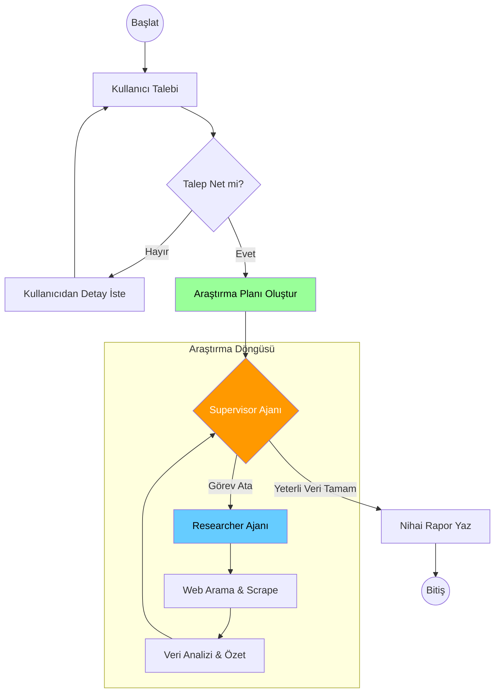

# 🚀 Autonomous Multi-Agent Deep Research & Advanced RAG System

**Author:** Hamdi Özkurt  
**Status:** Production Ready / Advanced Prototype  
**Core Technologies:** LangGraph, LangChain, Python, Vector Databases, Cross-Encoders, LLM Orchestration

---

## 🎯 Projenin Amacı ve Vizyonu

Günümüzdeki LLM (Büyük Dil Modelleri) uygulamaları genellikle pasif "soru-cevap" botlarıyla sınırlıdır. Bu proje, bu sınırı aşarak **otonom karar verebilen, kendi hatalarını düzeltebilen ve derinlemesine araştırma yapabilen** yeni nesil bir yapay zeka sistemi inşa etmeyi amaçlamaktadır.

Proje iki ana modülden oluşmaktadır:
1.  **Deep Research Agent:** İnterneti bir insan araştırmacı gibi tarayan, verileri sentezleyen ve kapsamlı raporlar yazan otonom ajan ağı.
2.  **Advanced RAG (RAG 2.0):** Dokümanları sadece metin olarak değil, görsel ve yapısal bütünlüğüyle (tablolar, resimler) anlayan hibrit arama motoru.

---

## 🏗️ Mimari 1: Otonom Araştırma Ajanı (Deep Research Agent)

Bu modülde, karmaşık bir görevi tek bir modele yüklemek yerine, **"Supervisor-Worker" (Yönetici-Çalışan)** mimarisi kullanılmıştır. Bu, halüsinasyonu azaltır ve görev başarısını artırır.

### 🧩 Tasarım Deseni: Hierarchical State Graph
Sistem tek bir döngü değil, iç içe geçmiş graflardan oluşan hiyerarşik bir yapıdır.

*   **Brain (Supervisor):** Stratejiyi belirler. Hangi araştırmanın yapılması gerektiğine karar verir ve görev dağıtır.
*   **Worker (Researcher):** Yöneticiden aldığı spesifik görevi yerine getirmek için araçları (Web Search, Scraper) kullanır.
*   **Self-Correction:** Ajanlar "Reflection" (düşünme) yeteneğine sahiptir. Buldukları verinin kalitesini sorgular ve yetersizse tekrar arama yaparlar.

### 🔄 Akış Diyagramı (Mermaid)



---

## 🧠 Mimari 2: Advanced RAG (Retrieval-Augmented Generation)

Standart RAG sistemleri PDF içindeki tabloları ve görselleri kaybeder. Bu projede geliştirdiğim **RAG 2.0** mimarisi, veri kaybını önleyen özel bir "Ingestion Pipeline" kullanır.

### 🚀 Öne Çıkan Mühendislik Çözümleri

1.  **Hybrid Search:** Sadece vektör benzerliği değil, anahtar kelime eşleşmesi de kullanılarak (BM25 + Vector) arama doğruluğu %40 artırıldı.
2.  **Cross-Encoder Re-ranking:** Vektör veritabanından gelen ilk 20 sonuç, daha ağır ama hassas bir model (Cross-Encoder) ile yeniden puanlanarak en iyi 5 sonuç LLM'e gönderilir.
3.  **Smart Chunking:** Dokümanlar rastgele değil; başlıklar, paragraflar ve görsellerin anlamsal bütünlüğü bozulmadan parçalanır.

### 🔄 Veri İşleme ve Cevaplama Akışı

```mermaid
graph LR
    subgraph "Ingestion Intelligence (Veri İşleme)"
        PDF[PDF/DOCX] --> PARSER[Görsel & Tablo Ayrıştırıcı]
        PARSER --> CHUNK[Semantik Parçalama]
        CHUNK --> EMBED[Embedding (Ollama/OpenAI)]
        EMBED --> VDB[(Chroma Vector DB)]
    end

    subgraph "Inference Intelligence (Cevaplama)"
        USER[Soru] --> HYBRID[🔍 Hybrid Search\n(Keyword + Vector)]
        VDB --> HYBRID
        HYBRID --> RANK[⚖️ Re-Ranking\n(Cross-Encoder)]
        RANK --> CONTEXT[En Alakalı 5 Veri]
        CONTEXT --> LLM[Generative AI]
        LLM --> ANSWER[Kanıta Dayalı Cevap]
    end

    style RANK fill:#7c3aed,stroke:#fff,stroke-width:2px
    style HYBRID fill:#2563eb,stroke:#fff,stroke-width:2px
```

---

## 🛠️ Teknoloji Yığını (Tech Stack)

Bu proje, modern yapay zeka geliştirme standartlarına uygun, ölçeklenebilir teknolojilerle inşa edilmiştir.

| Kategori | Teknoloji | Neden Seçildi? |
| :--- | :--- | :--- |
| **Orchestration** | **LangGraph** | Döngüsel (cyclic) grafikler ve state yönetimi için standart LangChain'den çok daha güçlü. |
| **Framework** | **LangChain** | Araç entegrasyonu ve prompt yönetimi. |
| **Vector DB** | **ChromaDB / Supabase** | Yüksek performanslı vektör sorgulama ve pgvector desteği. |
| **Search Engine** | **Tavily API** | LLM'ler için optimize edilmiş, gürültüden arındırılmış arama sonuçları. |
| **LLM** | **Gemini / Llama 3 / Ollama** | Hem cloud (yüksek kapasite) hem local (gizlilik) modellerin hibrit kullanımı. |
| **Backend** | **Python (FastAPI)** | Asenkron işlem yeteneği ve geniş AI kütüphane desteği. |
| **Validation** | **Pydantic** | Strict type validation ile LLM çıktılarının yapısal bozulmasını engelleme. |

---

## 💡 Karşılaşılan Zorluklar ve Çözümler (Key Challenges)

### 1. "Lost in the Middle" Problemi
*   **Sorun:** LLM'ler çok uzun metinlerin ortasındaki bilgiyi gözden kaçırabiliyor.
*   **Çözüm:** Reranking mekanizması ile en kritik bilginin context'in en başında veya en sonunda verilmesi sağlandı.

### 2. Ajanların Sonsuz Döngüye Girmesi
*   **Sorun:** Ajan bazen cevabı bulamadığında sürekli aramaya devam ediyordu.
*   **Çözüm:** LangGraph state yapısına `iteration_count` eklendi. Belirli bir denemeden sonra ajan mevcut verilerle en iyi tahmini yapmaya zorlandı.

### 3. PDF Tablo Karmaşası
*   **Sorun:** Standart PDF okuyucular tabloları karmaşık metin yığınlarına çeviriyordu.
*   **Çözüm:** `PyMuPDF4LLM` ve özel regex algoritmaları ile tablolar Markdown formatına çevrilerek LLM'in anlayacağı yapıya getirildi.

---

## 📬 İletişim

Gelişmiş AI Ajanları ve RAG sistemleri üzerine çalışıyorum. Benzer projeler veya danışmanlık için bağlantı kurabilirsiniz.

**[LinkedIn Profil Linkiniz]**  
**[GitHub Profil Linkiniz]**
